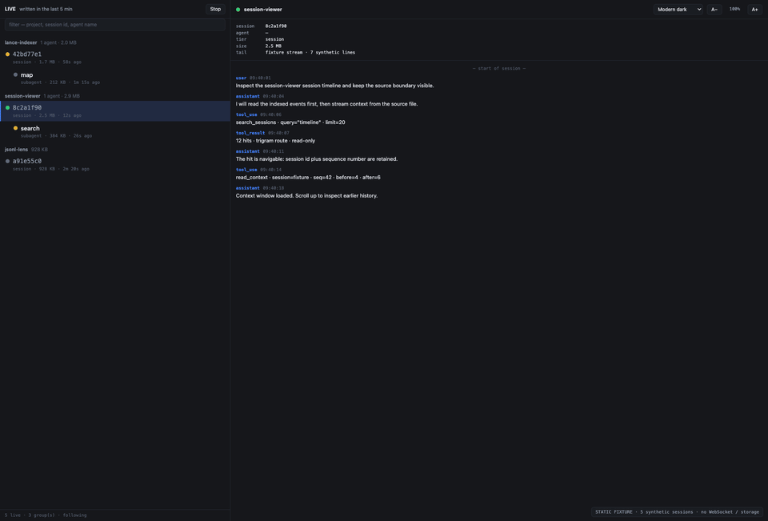
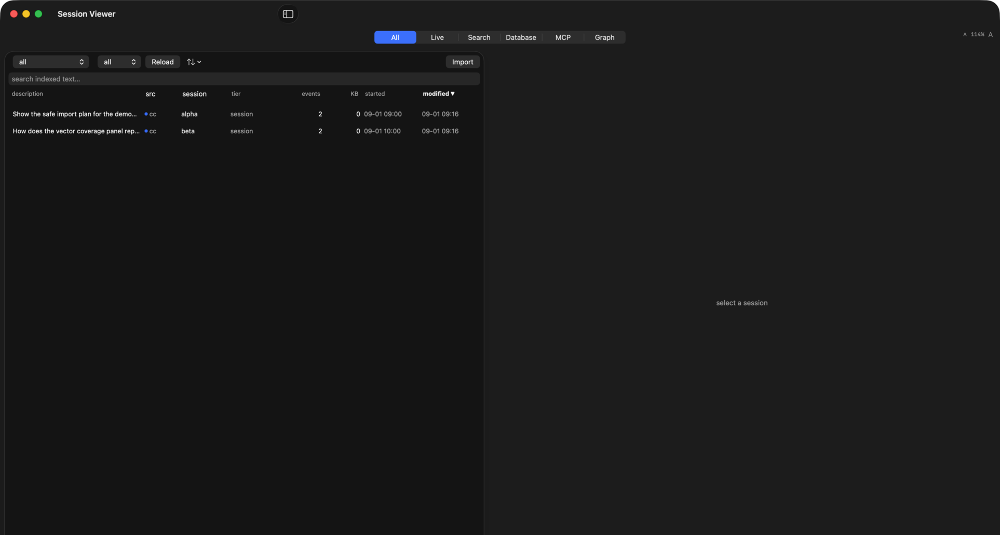

# Public fixture demo gallery

Captured from the public static Worker on 1 September 2026. The screen is the
real React `webapp` client running with a deterministic fixture mode; no local
WebSocket or transcript is involved.

## Native SwiftUI app

The local macOS binary is captured separately from the Worker demo. This is the
indexed-session view after importing **two synthetic JSONL files** into a temporary
SQLite cache; the screenshot contains no real transcript, home directory, or
credentials.

